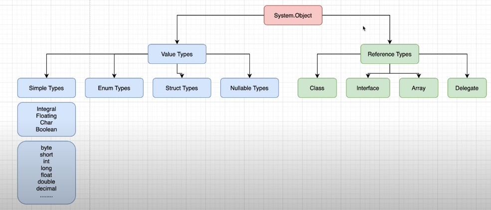

# .NET 👍

```c#
dotnet new --list //tipos de aplicaciones
dotnet new [name] //genera el template del proyecto!! --output pirulo
dotnet run [file] //correr
dotnet watch run // corremos el proyecto en y queda a la escucha
dotnet build //compilar standard genera .dll nativo de .netcore
dotnet build -c Release -r win10-x64 // ejecutable para window
```


